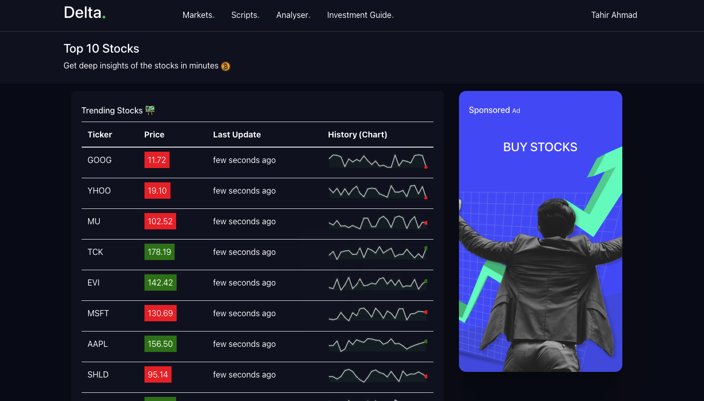

# Live Stocks App

Live Stocks is a one place trending stocks's price visualiser in real time.

## Key Features

* Usage of functional based components using Hooks
* Implementation of WebSockets
* Price history
* Live tickers

## Getting started

You can view a live demo over at https://live-stocks-tahir.netlify.app/

To get the frontend running locally:

Clone this repo
npm install to install all req'd dependencies
npm start to start the local server (this project uses create-react-app)
Local web server will use port 4100 instead of standard React's port 3000 to prevent conflicts with some backends like Node or Rails. You can configure port in scripts section of package.json: we use cross-env to set environment variable PORT for React scripts, this is Windows-compatible way of setting environment variables.

Alternatively, you can add .env file in the root folder of project to set environment variables (use PORT to change webserver's port). This file will be ignored by git, so it is suitable for API keys and other sensitive stuff. Refer to dotenv and React documentation for more details. Also, please remove setting variable via script section of package.json - dotenv never override variables if they are already set.
